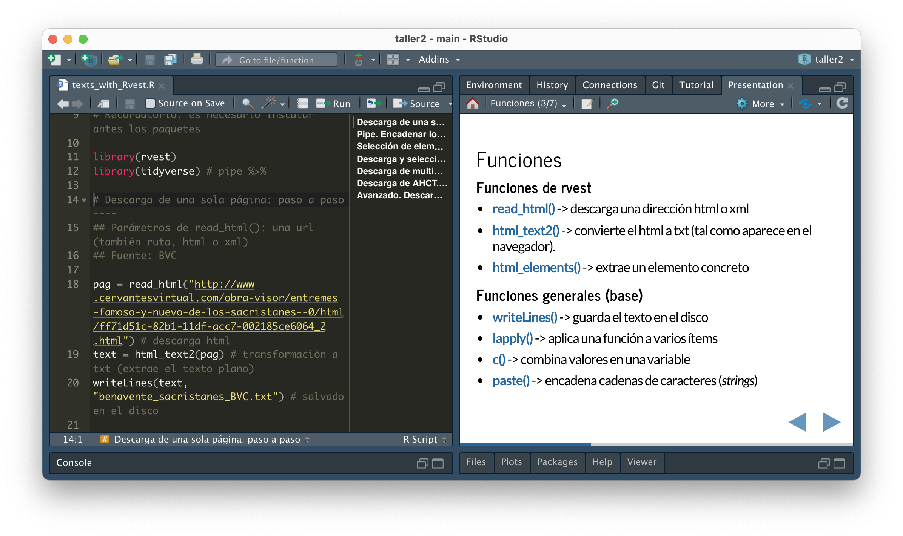
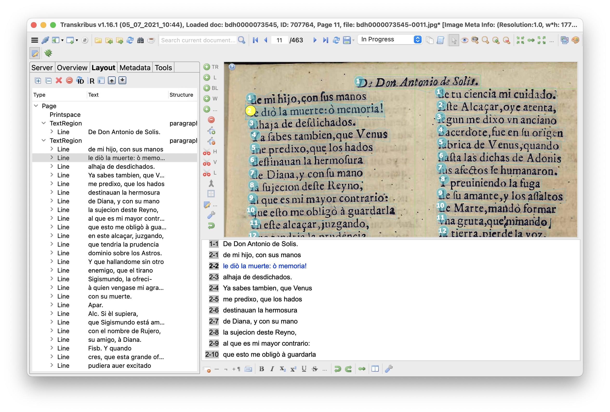

# **Taller 2. Datos**

1.  Tipos de datos
2.  Obtención de datos (`rvest` en R)
3.  Tratamiento de datos
4.  Reconocimiento automático
5.  Avanzado: obtención de datos con el terminal

## Tipos de datos

Libros, cuadros, representaciones teatrales, novelas, poesías o películas son objeto de estudio de las humanidades. Aunque no solemos referirnos a ellos como datos, podríamos afirmar que el texto de un poema, los diálogos de una obra teatral o los elementos visuales de un cuadro de Picasso son en sí mismos datos. Este sentido se relaciona con una primera definición de dato, que remite a todo documento, información o testimonio que nos permite llegar al conocimiento de algo. Entendido de esta manera estamos hablando, sin embargo, de datos analógicos, datos que no son explícitamente contables como valores separados y distintos, es decir, no pueden ser analizados computacionalmente (Schöch 2013). Por este motivo, a esa primera definición de dato se le añade un segundo sentido como información dispuesta de manera adecuada para su tratamiento por una computadora.

A pesar del sentido etimológico de dato, que deriva del latín *datum* ("lo que se da") y del uso extendido de la expresión "datos en bruto" (*raw data*), no deberíamos pensar en los datos como un recurso natural disponible y listo para su uso, sino un recurso cultural que debe ser localizado, generado, sistematizado e interpretado para que tenga sentido (Gitelman/Jackson 2013: 2-3).

Los datos se localizan, se crean, se limpian, se simplifican, etc., antes poder generar información con ellos. Vamos a hacer un repaso a los tipos de datos y luego veremos algunas maneras de obtenerlos, manipularlos, limpiarlos y prepararlos para el análisis.

Necesitamos **datos de entrada** para el análisis estilométrico, en nuestro caso, en forma de textos (txt, xml), pero debemos tener en cuenta también cómo manipular los posibles **datos de salida**. El paquete de `stylo` acepta textos en formato txt y xml; podemos obtener datos de salida, por ejemplo, en csv para elaborar redes.

Podemos hablar de tres categorías de datos: estructurados (modelo explícito), semiestructurados (ciertas unidades marcadas) y no estructurados (sin unidades predefinidas). Suelen ser asociados con los tipos de archivo: CSV, XML, HTML, MD, TXT.

| Tipos | Definición | Formatos de archivos |
| --- | --- | --- | 
| Datos no estructurados | Sin una organización en unidades semánticas, separadas y distintas | Suelen almacenarse en formatos de archivo plano, por ejemplo, TXT. | 
| Datos semiestructurados | Con una estructura formal parcial (lenguaje de marcado)  que marca unidades  distintas  | Suele almacenarse en archivos XML o HTML. El vocabulario TEI es también XML.  | 
| Datos estructurados | Con un modelo concreto de datos que los define de forma explícita  | Archivos en formato de tabla como CSV, así como hojas de cálculo de los formatos de Excel o OpenOffice. | 

### Datos no estructurados

    Hipogrifo violento,
    que corriste parejas con el viento,
    ¿dónde rayo sin llama,
    pájaro sin matiz, pez sin escama
    y bruto sin instinto
    natural, al confuso laberinto
    ...

-   Archivos en formato plano (*plaintext*).
-   Archivos con extensión .TXT

### Datos estructurados

| id  | título             | año  | etiqueta | disponible |
|-----|--------------------|------|----------|------------|
| 1   | Polifemo           | 1612 | poesía   | TRUE       |
| 2   | Quijote            | 1605 | novela   | TRUE       |
| 3   | Príncipe constante | 1647 | teatro   | TRUE       |
| 4   | Persiles           | 1617 | novela   | FALSE      |

-   Archivos en formato plano (*plaintext*)
-   Archivos con extensión .CSV
-   Compuestos de variables y observaciones

| Variable    | Variable    | Variable    | <i style="color: grey">etiqueta</i> | <i style="color: grey">disponible</i> |
|-------------|-------------|-------------|-------------------------------------|---------------------------------------|
| observación | observación | observación | <i style="color: grey">poesía</i>   | <i style="color: grey">TRUE</i>       |
| observación | observación | observación | <i style="color: grey">novela</i>   | <i style="color: grey">TRUE</i>       |
| observación | observación | observación | <i style="color: grey">teatro</i>   | <i style="color: grey">TRUE</i>       |
| observación | observación | observación | <i style="color: grey">novela</i>   | <i style="color: grey">FALSE</i>      |

El formato de archivo con la extensión `.CSV` se usa para estructurar datos en forma de tabla divididos en columnas y filas. En el fondo, el texto contenido está también en formato plano (*plain text*), solo que técnicamente usa ciertas convenciones (comas, comillas, saltos de línea) para estructurar los datos que contiene: la coma separa celdas; los saltos de línea separan filas; las comillas, rodean valores que tienen comas o saltos de línea; la primera fila (opcional) designa los nombres de las variables (columnas):

    id,título,año,etiqueta,disponible
    1,Polifemo,1612,poesía,TRUE
    2,Quijote,1605,novela,TRUE
    3,Príncipe constante,1647,teatro,TRUE
    4,Persiles,1617,novela,FALSE

Otras convenciones en archivos de texto plano, por ejemplo, ficheros .bibtex. La bibliografía del curso está disponible en formato .bibtex en el [repositorio](https://github.com/burgos2021/programa/blob/main/biblio/biblio_burgos2021.bib)

    @article{eder2016a,
      author = {Eder, M.},
      date = {2016},
      title = {Rolling stylometry},
      volume = {31},
      pages = {457–469},
      url = {https://doi.org/10.1093/llc/fqv010},
      doi = {10.1093/llc/fqv010},
      language = {en},
      journal = {Digital Scholarship in the Humanities},
      number = {3}
    }

### Datos semiestructurados

**XML**

Al texto no estructurado se le añade información semántica anotando algunas palabras con etiquetas dobles que rodean los elementos que nos interesan. El nombre propio se rodea con una etiqueta de apertura `<persName>` y otra de cierre `</persName>`.

`<persName>Miguel de Cervantes</persName> publicó la primera parte del <title>Quijote</title> en <date>1605</date>`

-   Expresados con lenguajes de marcado que anotan de forma separada y distinta los elementos dentro de datos.
-   Marcado descriptivo. Información semántica.
-   Archivos con extensión .XML (*eXtensible Markup Language*).
-   Vocabulario: TEI (Text Encoding Iniciative).

**HTML**

`Miguel de Cervantes publicó la primera parte del <i>Quijote</i> en 1605`

-   Archivos con la extensión .html (*Hypertext Markup Language*)
-   Marcado procedural: basado en la representación

**Markdown**

-   Archivos con la extension .MD (*Markdown*)
-   Marcado procedural simplificado: basado en la representación

`Miguel de Cervantes publicó la primera parte del _Quijote_ en 1605`

## Obtención de datos

### Textos de Internet en formato html. **rvest en R**

Internet es sin duda un amplio recurso de datos y textos. Estos están disponibles en varias formatos, pero una buena parte los encontramos todavía en html. Veremos una manera de automatizar la recolección de textos en formato html de Internet y transformarlos a texto plano, que nos interesa para el análisis.

Vamos a usar un paquete en R, `rvest`, pero coexisten varias maneras de descargar datos de la red, por ejemplo, usando la línea de comandos.

-   Véase la presentación dentro de Rstudio: `text_with_Rvest.Rpres > Preview`

## Tratamiento de datos

Los textos cosechados de Internet casi nunca terminan listos acorde a nuestras necesidades. Ya sean textos extraídos de un html, obtenidos de un proceso de OCR e incluso disponibles en una codificación XML, necesitarán alguna modificación que los ajuste a nuestras necesidades. Los metadatos, los encabezados, los errores, los nombres de los personajes de una obra teatral suelen ser eliminados para, por ejemplo, el análisis estilométrico. Para automatizar muchos de esos procesos de limpieza nos ayudan las expresiones regulares.

Las expresiones regulares, Regex (*Regular expressions*), son una manera de buscar no tanto una palabra o secuencia de palabras, sino un patrón. La búsqueda y sustitución de patrones nos permiten, de una manera rápida, rehacer, extraer, limpiar un texto. Una expresión regular es una secuencia de caracteres que funciona como patrón, es decir, con la muestra obtenemos su correspondiente: `\d` es un patrón para encontrar dígitos (del 0 a 9).

Las regex son una parte esencial de los lenguajes de programación, podríamos trabajar directamente con ellas en R, pero también podemos usarlas en un procesador de textos avanzado, como VScode, Sublime, oXygen, etc.

## Reconomiento automático

El reconocimiento automático de carácteres (OCR )o de textos manuscritos (HTR) es otra fuente de obtención de datos. [Tesseract](https://github.com/tesseract-ocr/tesseract) y [Transkribus](https://readcoop.eu/transkribus/) son dos herramientas habituales. Tienen en común la posibilidad de entrenar modelos que permitan un mejor reconocimiento de los textos. Las correspondencias de partida se preparan manualmente y sirven de entrada a los modelos.

En Transkribus contamos, en abierto, con modelos entrenados para impresos del Siglo de Oro, que nos permiten obtener versiones semi diplomáticas (preparado por Stefano Bazzaco) y normalizadas (preparado por Álvaro Cuéllar).

## Avanzado: obtención de datos con el terminal (cURL)

Una potente herramienta de línea de comandos para descargar datos de Internet es [cURL](https://curl.se). De manera similar a `rvest` podemos automatizar la descarga desde de una URL de páginas para salvarlas en un archivo.

`curl http://example.com -o filename`

Si queremos descargar varias secuencias alfanuméricas de una URL podemos especificarlas entre corchetes `[1-3]`. En el nombre del archivo de salida usamos `#` para crear una variable que será remplazada por la secuencia alfanumérica:

`curl http://example.com/file[1-3].html -o file#1.html`

En conjunción con otros comandos (UNIX), `textutil` (conversión a txt) y `cat` (concatenación) podemos descargar, convertir a texto plano y unir los archivos en uno solo.

`textutil -convert txt file(s).html`

`cat files*.txt > merged-file.txt`

**Ejemplo para ejecutar en el terminal**

`curl http://www.cervantesvirtual.com/portales/francisco_rojas_zorrilla/obra-visor/los-aspides-de-cleopatra-2/html/ff0ae30c-82b1-11df-acc7-002185ce6064_[2-4].html -o zorrilla#1.html`

`textutil -convert txt zorrilla*.html`

`cat zorrilla*.txt > RojasZorrilla.txt`
