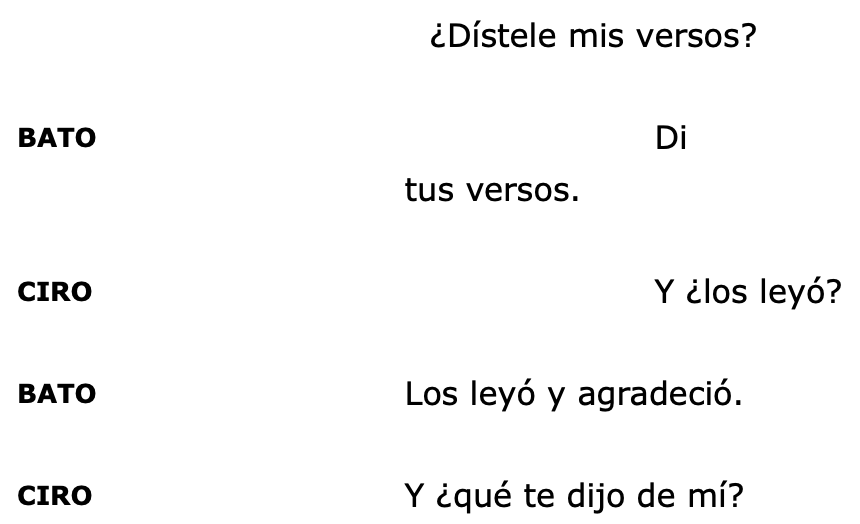

Desgarga de páginas con rvest
========================================================
title: R/Rstudio
author: José Luis Losada Palenzuela
date: 25/08/2021
autosize: TRUE

Fuentes de textos en línea
========================================================

- [Artelope](http://artelope.uv.es/biblioteca/)
- [Biblioteca Virtual Cervantes](http://www.cervantesvirtual.com)
- [AHCT (Association for Hispanic Classical Theater)](http://www.wordpress.comedias.org/play-texts/)

Funciones
========================================================

### Funciones de rvest

- **read_html()** -> descarga una dirección html o xml
- **html_text2()** -> convierte el html a txt (tal como aparece en el navegador).
- **html_elements()** -> extrae un elemento concreto

### Funciones generales (base)

- **writeLines()** -> guarda el texto en el disco
- **lapply()** -> aplica una función a varios ítems
- **c()** -> combina valores en una variable
- **paste()** -> encadena cadenas de caracteres (_strings_)

Selección de elementos: html_elements()
========================================================

Marcado en el html
========================================================

**`html_elements(".versoF")`**

Marcado en el xml-tei
========================================================

**`html_elements("l")`**

Múltiples páginas: Bucles 
========================================================

Una manera de evitar construir bucles (_loops_) para descargar páginas con el paquete rvest es usando la función `lapply()` de paquete base.

### Funciones nuevas para este procedimiento
- `lapply()`
- `paste()`
- `c()`
